# GitGotchi: The Pet That Eats Your Commits 🐉

> **Turn your GitHub Profile into a game!** GitGotchi sits on your profile README and grows based on your daily coding activity.



[](https://github.com/marketplace/actions/gitgotchi-profile-pet)
[](https://opensource.org/licenses/MIT)

## 🎮 What is GitGotchi?

GitGotchi is a **zero-config GitHub Action** that generates a high-quality SVG "trading card" of a virtual pet. This pet lives and dies by your code:

- **Hunger (HP)**: Your pet loses HP every day. Feed it by **Committing code**.
- **Growth (XP)**: Earn XP from Commits, PRs, and Issues to evolve your pet from an **Egg** 🥚 to a **Legendary Creature** 🐉.
- **Streak**: Maintain a daily coding streak to unlock **XP Multipliers** (1.5x) and keep your pet Happy! 
- **Evolution**: Watch your pet change forms as it levels up (Level 1-4). Look out for the Ghost state if you neglect it! 👻

---

## 🎨 Themes & Customization

Make your GitGotchi match your profile aesthetic. Customization is built-in!

### **Pet Types**
Choose your companion:
| Type | Description |
| :--- | :--- |
| **`dragon`** 🐉 | The classic fire-breather. Majestic and fierce. (Default) |
| **`cat`** 🐱 | Cute, cuddly, and judging your code quality. |
| **`ghost`** 👻 | For those who love the spooky season all year round. |

### **Color Themes**
Select a theme that fits your vibe:
- **`dark`**: Sleek midnight blue and grey. (Default)
- **`light`**: Clean white and soft shadows.
- **`ocean`**: Deep sea greens and teals.
- **`dracula`**: Vampire-inspired purple and pink palette.

---

## 🚀 Quick Setup (3 Minutes)

### Step 1: Get a Token
You need a Personal Access Token (PAT) so GitGotchi can read your contribution stats.
1. Go to **Settings** → **Developer settings** → **Personal access tokens** → **Tokens (classic)**.
2. Generate a new token with **`repo`** and **`user`** scopes.
3. Copy the token.
4. Go to your Profile Repository's **Settings** → **Secrets and variables** → **Actions**.
5. Create a **New Repository Secret** named `USER_TOKEN` and paste your token.

### Step 2: Create a Template
In your repository root, create a file named `TEMPLATE.md`. This will be the source for your README.
Add the placeholder where you want the image to appear:

```markdown
# Hi there! 👋

Here is my GitGotchi:
{{ gitgotchi }}

Check out my other projects...
```

### Step 3: Add the Workflow
Create `.github/workflows/gitgotchi.yml` and paste this configuration:

```yaml
name: GitGotchi Update
on:
  schedule:
    - cron: '0 0 * * *' # Runs every night at midnight UTC
  workflow_dispatch: # Allows manual run

permissions:
  contents: write

jobs:
  feed-pet:
    runs-on: ubuntu-latest
    steps:
      - uses: actions/checkout@v4
      
      - name: Update GitGotchi
        uses: night-slayer18/gitgotchi@v1
        with:
          token: ${{ secrets.USER_TOKEN }}
          pet_name: 'Codezilla'
          pet_type: 'dragon' # Options: dragon, cat, ghost
          theme: 'dracula'   # Options: dark, light, ocean, dracula
          
      - name: Commit & Push
        run: |
            git config user.name github-actions[bot]
            git config user.email 41898282+github-actions[bot]@users.noreply.github.com
            if [[ -n $(git status --porcelain) ]]; then
              git add README.md .github/gitgotchi
              git commit -m "🍱 specific: Feed GitGotchi"
              git push
            fi
```

### Step 4: Run it!
Go to the **Actions** tab in your repository, select "GitGotchi Update", and click **Run workflow**. 
Check your profile README to see your new pet!

---

## ⚙️ Configuration Inputs

| Input | Description | Default | Required |
| :--- | :--- | :--- | :---: |
| `token` | Your GitHub PAT. | - | ✅ |
| `pet_name` | The name displayed on the card (max 12 chars recommended). | `GitGotchi` | ❌ |
| `pet_type` | Species of your pet: `dragon`, `cat`, `ghost`. | `dragon` | ❌ |
| `theme` | Color theme: `dark`, `light`, `ocean`, `dracula`. | `dark` | ❌ |
| `template_file` | Source markdown file. | `TEMPLATE.md` | ❌ |
| `out_file` | Generated markdown file. | `README.md` | ❌ |
| `assets_dir` | Where to save the SVG and state file. | `.github/gitgotchi` | ❌ |

---

## 📊 Scoring Rules

| Action | Reward | Cap |
| :--- | :--- | :--- |
| **Commit** | +5 XP / +20 HP | Max 50 XP per run |
| **Pull Request (Merged)** | +50 XP | - |
| **Issue Closed** | +20 XP | - |
| **Streak Bonus** | 1.5x XP Multiplier | Active after 3 days |

---

## 🤝 Contributing

Got a better sprite idea? Want a new theme? PRs are welcome! 
Check out `src/renderer/assets.ts` to add new vectors or `src/renderer/themes.ts` for colors.

**License**: MIT